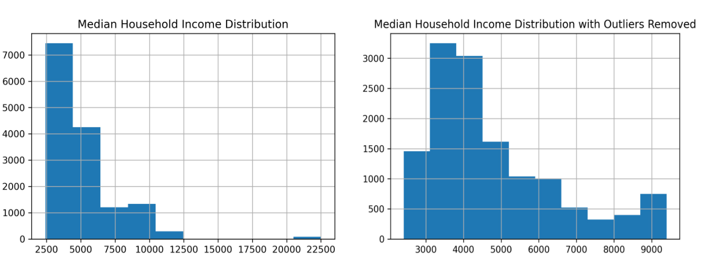
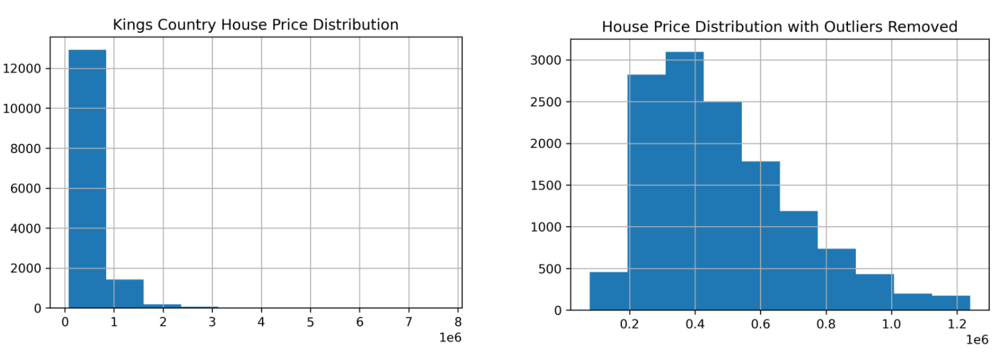
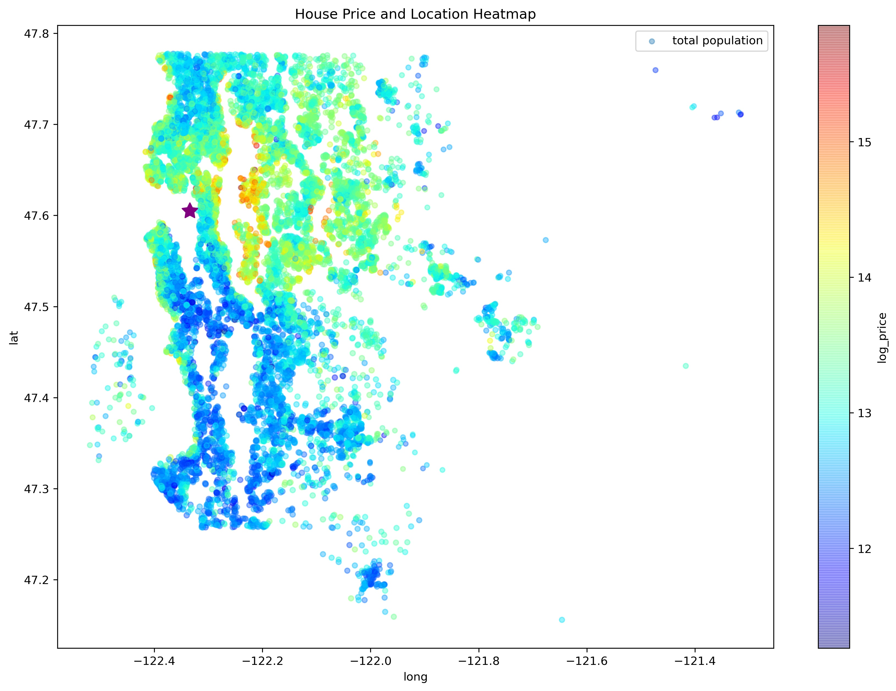
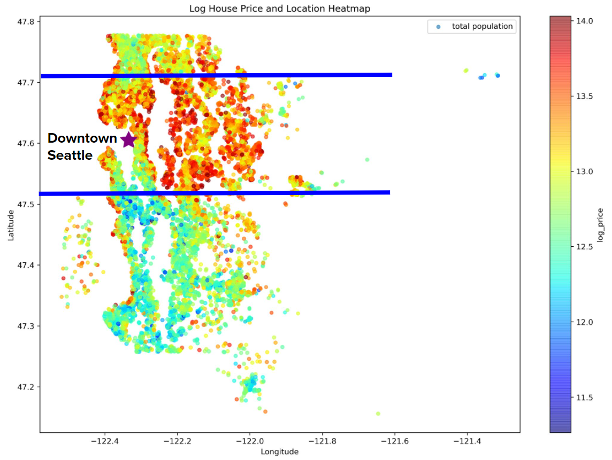
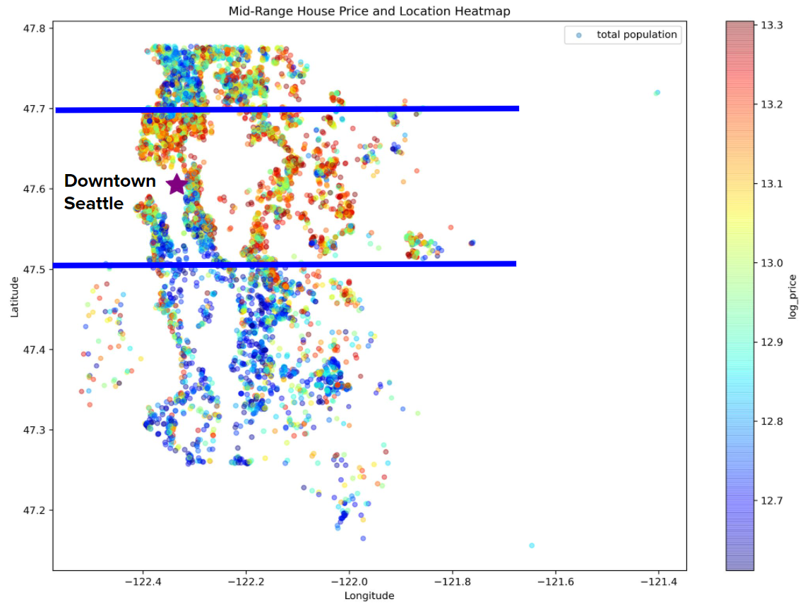
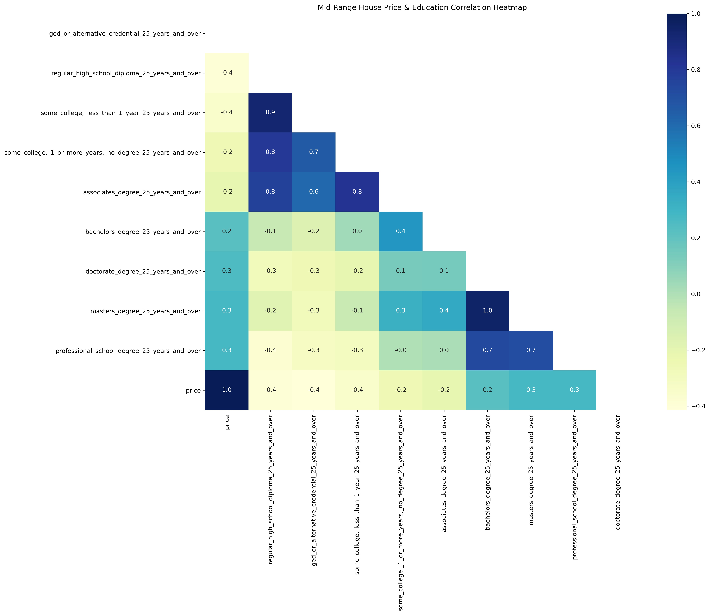

# Locating Your Home: An In-Depth Analysis on Housing Locations and Prices in Kings County, WA

**Author**: Melvin Garcia

## Overview
The aim of this report is to derive insights on the types of location-based features that influence house prices. The data for this report comes from official public records of homse sales in King County, Washington State along with demographic data of the area from the National Historical GIS. These data insights are to help inform our real estate agency stakeholders provide general advice for their clientele on where to potentially buy a house. Location is a feature of interest because there is a identified cohort of home-buyers that are out-of-state and are looking to buy a vacation home. The method to analyze our location based-features and houseprices in Kings County, WA is though regression modeling. Regression modeling will allow us to identify which features having an impact on house prices -- which features matter most, and which features can be ignored. From this analysis, it was was observed that the rating how good the view of the property was and a house located within and outside a latitude range of 45.5 and 47.7 latitude will have the most impact on housing prices. From including the demographic data, it was also observed education level, specifically having a GED or a Masters Degree had an impact on housing prices. As a result in regards to location, we are able to advise the following: living within the specified latitude range can increase the house price by $65,910, and the rating of the view of a property can increase the house price by $84,910.

## Business Problem
The real estate agency had noticed a growing cohort of clientele inquiring about buying a vacation home in Kings County WA. At the same time, a characteristic of these clients are out-of-state likely with limited experience of the landscape and locations in Kings County. Therefore in order for our real estate agency to provide sound advice on potential locations and their corresponding prices, our stakeholder is interested in location based features and their impact on house prices.

## Data
The data used for this report comes from the official public records of the home sales in the Kings County area of Washington State. The data contains 21,597 with home sales from May 2014 - May 2015. The data points contained within this dataset range from the number bedrooms, bathroom, the square footage of the interior living space, the year the house was build, and the latitude and longitude of the home. The demographic data are aggragated on a zipcode basis and hence was joined to our sales data using this the key. The demographic data contained data points from median age, median income, total population, racial population, and  education level demographic.

## Methods
The overall steps to set up our data and perform iterative regression modeling is to:
1. Prepare & Explore the data
2. Clean the data
3. Build our model and check we're meeting the model's assumptions
4. Learn from our model's coefficients, p-values, and R-sqaured, optimize our features for the model , and repeat step 3 with optimized features

**Preparing and Exploring the data**

This step was confirming the data sources and features to examine -- that is the Kings County, WA home sales data as well as the NHGIS demographic data while targeting location-centric based features. The next and one of the most important step to perform is data exploration to examine and obvious correlations between our features and our target of house price, and being mindful of the features that are potentially relevant to our stakeholders.

**Clean the data**

Another important step to perform that is done in conjunction with data exploration is examining the data quality ie. missing values, mis-inputs, etc. For example, the features missing the most entries included whether a property contained a waterfront and the year the house was renovated. The waterfront feature was more relevant for our analysis, and we dropped year renovated. Tt was discovered that ~11% of the total rows of the dataset were missing the waterfront feature. As a result, we decided to simply drop the rows missing waterfront reducing our dataset from 21,597 rows to 19,164.

Another consideration during this step is observing the outliers and handling any skewed distrubutions within our features or target that may affect our regression modeling efforts. The strongest right-skewed observations were seen within the median income feature and house price distributions. Outliers were removed for median income instances with a z-score larger than 2.

**Build our model and check we're meeting the model's assumptions**

In building our model, the steps include selecting our features, engineering any desired features, and transforming them in a way our regression model can ingest for an informative output. For example, our waterfront and view features are categorical, therefore we would one-hot-encode for the model to interpret them as distinguished classes versus one class being viewed as 'higher' or 'lower' in value. Morever, the distance from downtown was a location-based feature created calculating the geo distance from the home's lat lon coordinates from the coordinates of downtown Seattle.

After preparing our features, we build our model and interpret the resulting R-squared, intercept, feature coefficients, and p-values to evaluate how well the features explain the variance within our house price target. 

The next step is to evaluate how we're meeting the linear regression model assumptions -- Linearity, Normality, and Homoscedasticity. These assumptions are checked through a slew of statistical tests such as: rainbow test for linearity, QQ plotting for normality check, and plotting our model's residuals around the house price for homoscedasticity. 

**Learn from our model's coefficients, p-values, and R-sqaured, optimize our features for the model , and repeat step 3 with optimized features**

Lastly, after evaluating how well our previous model meet's linear regression assumptions, mulitcollinearity, and p-values explaining how significant a change in our target house price is related to changes in the feature -- we may want to remove, add, or engineer new features to improve. For example, it was discovered that median age has high multicollinearity with other features the model and so it was removed as a feature. Moreover, a house's distance from downtown Seattle had a p-value larger than our 0.05 significance threshold and so it was also removed as a feature.

This process of evaluating our features and how well they meet linear regression assumptions is repeated until we are satisfied with the features being used, assumptions being met, the model's R-squared, and most of all how the results help tell our story. 

## Results

### Visual 1

In the left image, the median household income distribution appears strongly right-skewed with apparent outliers.

Removing the outliers in the median household income show a slight bimodal peak. Even with removing the outliers with a z-score higher than 2, the distribution of median household income still appears right-skewed.

### Visual 2

In the left image, there appears a strong right skew with the Kings County house prices. Removing these may help with the issues we saw with the initial linear regression assumption checks.

Removing the outliers in the house prices bring the range of the house prices to a more normal distribution, however there is still an observable right skew.

### Log House Price-Location With Outliers Heatmap

The above visual examines the distribution of log house price ($) with the outliers in Median Income and House price. The map appears more saturated with blue and green coloring indicating a housing market of comprised mostly of low to mid-range housing. With the outliers in place, it is difficult to distinguish a range of sold house prices, hence a next natural step is to remove the outliers in our dataset. 

### Log House Price-Location without Outliers Heatmap

The above visual examines the distribution of log house price ($) after the outliers in Median Income and House price are removed. With the outliers removed, there is a more clear separation and visible spectrum of house price indicated by the blue, green, yellow, and red color scheme allowing the more expensive and mid-range housing to appear more prominently. 

### Mid-Range ($400k-$600k) Log House Price-Location Heatmap 

Focusing on the mid-range housing prices based on their location, there appears to be a slight separation between the more expensive houses in red located north of 47.5 latitude, and less expensive houses south of 47.5 latitude as distinguished by the red and blue regional coloring.

### Mid Range House Prices and Education Correlation Heatmap

After filtering our dataframe focusing on the range of house prices with the largest residuals, we set up the heatmap correlation matrix to examine additional features that could help with the homoscadasticity assumptions we saw from earlier model iterations. Including features from the census data, we can see that ged_or_alternative_credential_25_years_and_over has a moderately strong negative correlation that we can add.

## Conclusions

Considering location based features of a house, what I would present to our real estate agency stakeholders is that a house without regard to to any feature input is expected to have a house price of $500,700. Depending on the quality of the view of the property, the price of a house can increase by $84,900. Lastly, buying a home within the specified region of 45.5 and 47.7 latitude can also increase the price by $65,910.

For our distance from downtown Seattle feature, we failed to reject the null hypothesis and that its relationship with house prices is not statistically significant. In other words, what was once initially thought where house price had a relationship its distance from downtown, it appears it is not a meaningful addition to the model.

## Next Steps
Based on the presented analysis, there are more steps we can take to improve our model. One next step to include is experimenting with logarithmic and exponential transformations of the features to observe for any increase in our R-squared. Another good next step is viewing how the house price changes over time in regards to changing demographics. Some demographics to consider include:
* GDP
* Household Income
* Supply of Housing
* Unemployment rate
* Age
* Education

## For More Information

Please review our full analysis in [our Jupyter Notebook](./0-KingsCountyWA_Location_Housing_Analysis.ipynb) or our [presentation](./KingsCounty_HousingAnalysis_Flatiron_Presentation_MG.pdf).

For any additional questions, please contact **Melvin Garcia garciamelvin4@gmail.com**

## Repository Structure

```
├── README.md                           
├── 0-KingsCountyWA_Location_Housing_Analysis.ipynb  
├── KingsCountyWA_Location_Housing_Analysis.pdf
├── KingsCounty_HousingAnalysis_Flatiron_Presentation_MG.pdf
├── data
└── images
```
